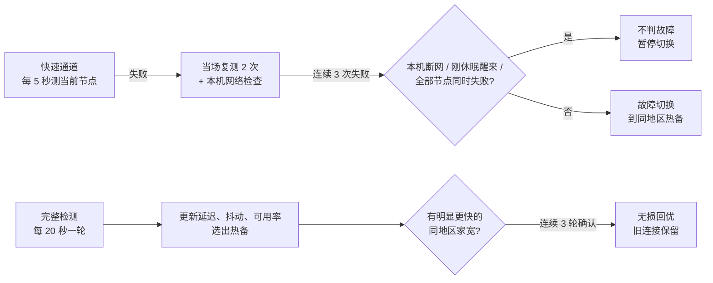

# 稳航 SteadyRoute

稳航是一个跑在 macOS 上的 Clash Verge / Mihomo 家宽线路控制器。它照看 Clash 里正在用的每条线路：按当前节点的国家锁定，一直测节点，节点坏了几秒内换到同国家的家宽热备，节点变慢时在不打断现有连接的前提下换到更快的同国家家宽，并在本机提供看板。

可选的 **AI 家宽专线**：在设置页选一个国家，稳航在 Clash 里建立只含该国家家宽节点的专线，ChatGPT、Claude 等 AI 服务的规则（以 [ip.net.coffee](https://ip.net.coffee/) 为第一优先级，每周自动同步）排在所有规则之前。

- 只用 Python 3.9 标准库，没有第三方依赖。单进程，由 LaunchAgent 开机自启、异常自动拉起。
- 不改订阅，不上传任何数据；只有在设置页确认后才会往 Clash 写入专线，关闭即完整撤销。看板只监听 `127.0.0.1:17654`。
- 当前版本：**v0.5.1**（2026-09-30）。

## 快速开始

需要 macOS 和 [Clash Verge Rev](https://github.com/clash-verge-rev/clash-verge-rev)。新装、升级、换电脑都是同一步：

```bash
git clone https://github.com/z13141557217-web/steadyroute.git
cd steadyroute
./install.command
```

也可以下载 [Releases](https://github.com/z13141557217-web/steadyroute/releases) 里的 `SteadyRoute-v<版本>.zip`，解压后右键 `install.command` → 打开。装好后自动打开看板 <http://127.0.0.1:17654/>；AI 家宽专线在看板右上角的“设置”里开启。

---

## 目录

- [它解决什么问题](#它解决什么问题)
- [铁律：只在同地区家宽之间切换](#铁律只在同地区家宽之间切换)
- [工作原理](#工作原理)
- [看板与页面](#看板与页面)
- [AI 家宽专线](#ai-家宽专线)
- [安装、升级与卸载](#安装升级与卸载)
- [日志与数据](#日志与数据)
- [资源占用](#资源占用)
- [隐私与安全](#隐私与安全)
- [仓库结构](#仓库结构)
- [开发与测试](#开发与测试)
- [版本历史](#版本历史)
- [路线图](#路线图)
- [文档索引](#文档索引)

---

## 它解决什么问题

AI 服务对出口 IP 很敏感。出口在不同地区之间来回跳，或者从家宽变成机房 IP，都可能触发额外验证。Clash 自带的 `url-test` / `fallback` 只看一次测速的快慢，会出现以下问题：

| Clash 自带策略的问题 | 稳航的做法 |
|---|---|
| 只按单次测速选，抖一下就换，出口频繁变化 | 按平均延迟、抖动、24 小时可用率综合判断；回优有门槛、要连续确认、有冷却时间 |
| 节点断了要等下一次测速（分钟级）才发现 | 当前节点每 5 秒探测，连续 3 次失败即确认，断线到切换约 6 秒 |
| 换节点会打断正在进行的对话、上传 | 回优时旧连接保留到自然结束，只有新请求走新节点 |
| 候选列表写死，订阅换了节点名就失效 | 每轮从订阅自动发现同国家的家宽，新节点预热后参与选路 |
| 本机断网、合盖休眠、网站自己挂了，都会被当成节点故障 | 这些情况都能识别，不冤枉节点 |
| 不知道它为什么换、什么时候换 | 看板直接显示原因和下一步；每次决策写入结构化日志 |

---

## 铁律：只在同地区家宽之间切换

> **每条线路锁定一个国家，只会换到这个国家的家宽：台湾线路只用台湾家宽，香港线路只用香港家宽。**

这条规则没有例外。同地区的家宽全部不可用时，稳航保持当前选择、继续检测，并在看板上用红色提示，不会为了"能连上"而换到其他地区或机房节点。

规则在三层都有检查：

1. **生成策略时**：每轮按分组当前节点的国家生成策略，候选只取同国家、名称带家宽标记的节点。
2. **选路前**：候选列表按国家和家宽规则再过滤一次。
3. **向 Mihomo 下发切换（`PUT`）前**：最后一次校验，越界的选择直接拒绝并记录。

候选节点按名称识别（[`regions.py`](src/steadyroute/regions.py)）：

- 国家：中英文名、常见缩写和国旗，例如“台湾 / 台灣 / 🇹🇼 / TW”。
- 家宽：“家宽 / 住宅 / Residential / ISP / HiNet / Seednet / HKT / HKBN”等。
- 排除“到期、剩余流量、官网”这类提示条目。

AI 家宽专线在 Clash 层面同样遵守这条规则：分组只包含所选国家的家宽节点，节点全部不可用时拒绝连接（`empty-fallback: REJECT`），不会回落到直连。

`DIRECT` 只用于只读的本机网络检测，任何路径都不会把线路切到 `DIRECT`。

---

## 工作原理



### 检测节奏

| 检测 | 频率 | 内容 |
|---|---|---|
| 快速通道 | 每 5 秒 | 只测当前节点，纯 HTTP 204，约 1 KB，2 秒超时 |
| 完整检测 | 每 20 秒一轮（固定速率） | 所有候选的 HTTPS 连通和延迟；热备单独测一次；轮流抽查备用节点 |
| 业务检测 | 每 60 秒 | 通过当前节点和热备打开检测页（AI 专线：ChatGPT、Claude 的网页与 API 地址） |
| 本机网络 | 怀疑故障时 | 绕开代理直接测，区分"节点坏了"和"本机没网" |

### 故障切换

1. **发现**：当前节点一次探测失败。
2. **复测**：同一轮内立刻错峰再测 2 次，同时检查本机网络。
3. **确认**：连续 3 次失败才算故障。
4. **切换**：换到同地区热备。热备 120 秒内没有业务检测成功时，先确认它能打开 AI 网站再换。
5. **断开**：只断开还挂在坏节点上的连接，应用会自动重连。

以下情况**不会**判故障：

- 本机断网。
- Mac 刚从休眠醒来。醒来后的第一轮检测只记录成功的结果，不做切换决策。
- 这一轮所有节点同时失败，这时判断为本地或 Clash 的问题。
- 当前节点和热备都打不开同一个 AI 网站。这算网站故障，5 分钟内预检跳过该网址。

**故障风暴保护**：10 分钟内故障切换达到 3 次后，每次切换前都必须完整验证目标节点。

### 无损回优

节点没坏但有更好的同地区家宽时，同时满足以下条件才换：

| 条件 | 默认值 |
|---|---|
| 至少快 | 180 ms **且** 30% |
| 连续确认 | 3 轮 |
| 两次回优间隔 | 30 分钟 |
| 候选要求 | 近 24 小时可用率 ≥ 90%，样本 ≥ 10 |

换节点后，新请求走新节点，旧连接留在原节点直到自然结束。代理组设置了 `interrupt-exist-connections: false`，稳航也不主动关闭旧连接。

**手动偏好**：你在 Clash 里手动选了另一个同地区家宽后，稳航会尊重这个选择 1 小时，期间不回优。但你选的节点坏了仍会故障切换。

### 坏节点隔离

- 10 分钟内失败 3 次 → 隔离 30 分钟，期间不会被选中。
- 隔离期满进入"半开放验证"，连续成功 3 次才恢复。
- 被同一轮其他探测否定的偶发失败（比如复测成功）只计入可用率，不计入隔离。

### 节点状态

| 状态 | 含义 |
|---|---|
| 节点正在预热 | 新节点在积累样本：至少 10 次探测、连续成功 3 次、至少打开过一次 AI 网站 |
| 节点健康 | 可作为当前节点或热备 |
| 节点质量下降 | 能用但最近有失败，不会被主动换上 |
| 节点已隔离 | 暂停使用 |
| 节点正在半开放验证 | 隔离期满，正在确认恢复 |
| 节点已退役 | 已从订阅中消失，记录保留 24 小时 |

所有阈值由后端下发到看板和使用说明页，改了配置页面会自动跟着变。

---

## 看板与页面

所有页面都在本机 `http://127.0.0.1:17654`，不加载任何外部资源，断网时也能打开；除设置页外均为只读。

| 地址 | 内容 |
|---|---|
| `/` | **看板**，见下方说明 |
| `/nodes` | **全部节点（只读）**：订阅里的每个节点按地区分组，显示 Clash 自己最近一次测速；标出"当前在用 / 热备 / 候选 / 仅查看"。可按地区、家宽 / 非家宽筛选和搜索 |
| `/settings` | **设置**（均为可选）：AI 出口国家、其他网站、自动切换的分组；旧版线路升级；高级信息（规则同步、地理数据库、写入位置）。修改只接受本页请求 |
| `/guide` | **使用说明**：从工作原理到每个数字的含义；文中数值从运行中的服务读取 |
| `/changelog` | **更新日志**：每个版本面向使用者的变化，高亮正在运行的版本 |
| `/api/status` | 看板用的状态快照（兼容格式） |
| `/api/v1/status` | 版本化状态契约，见 [STATE_API.md](docs/STATE_API.md) |
| `/api/nodes` | 订阅节点目录（全部节点页用） |

看板包括：

- **顶部状态面板**：动态稳航图标（正常为蓝色，需留意为橙色，故障为红色）、各线路的实时延迟、24 小时切换次数（故障 / 回优）、内存当前值与峰值、累计检测轮数。
- **线路卡片**（每行两张）：锁定国家、当前节点、热备、平均延迟、近 24 小时可用率、抖动、综合评分、活跃连接；AI 专线带“AI 专线”标记与“检测出口 IP”链接；设置页另有网站建议的 DNS 泄露、WebRTC 检测链接。未接管的分组单独列出原因。
- **延迟曲线**：可看 5 / 15 / 30 分钟。
  - 实线是当前节点，虚线是热备。
  - 红色实线标故障切换，绿色虚线标无损回优。
  - 鼠标悬停或点按可看具体数值。
- **活跃连接面板**：按节点、按网站列出连接。回优交接期间，旧节点上的连接单独标出。只显示域名。
- **节点表**：按地区分组，含状态、连续成功 / 失败次数。
- **指标说明**：每个指标旁的"?"支持悬停、点按和键盘聚焦，并可跳到使用说明对应章节。

所有接口只读取每轮检测结束时生成的缓存，访问页面不会触发任何探测。

---

## AI 家宽专线

可选功能，在设置页 `/settings` 开启。写入 Clash 前列出分组成员与规则差异，确认后才生效。

- **分组**：select 类型，自动包含所选国家的全部家宽节点（订阅更新后自动跟随），排除提示条目；`empty-fallback: REJECT`（Mihomo 默认的 COMPATIBLE 等于直连）；UDP 与 NTP 时间同步同样经专线出口（net.coffee 要求开启 UDP 代理、NTP 走代理出口）；只在节点故障时切换，出口 IP 尽量不变；需要 Clash 内核 mihomo v1.19.27 或更新（`empty-fallback` 从该版本起才生效，旧内核拒绝写入）。香港、澳门、俄罗斯、中国大陆不在 ChatGPT / Claude 的服务范围内，不可选。
- **规则**（全部排在用户规则之前）：
  1. [ip.net.coffee](https://ip.net.coffee/claude/) 的 Claude 分流规则（22 条，含 Anthropic IP 段与 ASN 399358，以及网站列在最后的 `GEOSITE,category-ntp`）和 ChatGPT / Codex 分流规则（`GEOSITE,openai` + 12 条），与网站一致，不做删改。
  2. 社区合集 `GEOSITE,category-ai-!cn`（Gemini、Grok、Perplexity 等）。
  3. AI 桌面 App 与命令行（按进程名）。
  4. 设置页手动添加的域名。
- **自动维护**：每周同步 net.coffee 规则（数量、核心域名、规则类型、单次移除比例都有检查，异常时继续用现有规则；失败后 6 小时重试，连续失败 3 次后每天一次；设置页可立即同步）并更新地理数据库；每小时自检，切换订阅或规则丢失时自动重新写入。
- **写入方式**：写入 Clash Verge 当前订阅的扩展分组 / 扩展规则文件（标记块内），更新订阅不丢失。每次写入先由 Clash 内核校验、自动备份，重载后核对分组，任一步失败完整恢复并选回原节点。
- **撤销**：关闭专线或卸载稳航，写入内容全部撤销，被替换的旧分组定义原样放回。
- **AI 分流体检**：设置页按 Clash 当前生效的规则推演 net.coffee 列出的 34 项域名与 IP，显示命中规则、分组链、出口节点与国家。看板专线卡片上的“检测出口 IP”打开 ip.net.coffee 查看 AI 服务实际看到的地址。

## 安装、升级与卸载

仓库和发布包布局相同，都用根目录的 `install.command`（即 `/usr/bin/python3 scripts/installer.py install`）：

```bash
./install.command
python3 scripts/installer.py status
./uninstall.command
```

安装器：检查 macOS、Python 3.9+ 与 Clash Verge → 停止旧服务 → 备份当前版本 → 安装程序、保留设置 → 启动并确认看板回报的是新版本；失败自动恢复上一版（保留最近 3 份备份）。`uninstall.command` 先停止服务，再撤销写入 Clash 的专线和规则，最后删除程序（`--purge` 连日志一起删除）。

**旧版迁移**：安装器会识别运行 `weighted_router.py` 的旧 LaunchAgent（v0.5.0 及以前的固定台湾 / 香港配置，或 v0.5.0 分享版），带过状态、节点历史和日志，把旧设置转换为新格式；新服务确认正常后才停用旧版自启（plist 移到备份目录），失败则重新启动旧版。旧版的台湾 / 香港线路作为迁移建议出现在设置页，确认后改为同名、自动筛选同国家家宽的专线，Clash 中引用这些分组的规则继续有效。

| 用途 | 路径 |
|---|---|
| 程序、状态、设置 | `~/Library/Application Support/SteadyRoute`（`config/route-policies.json`、`state.json`、`clash-applied.json`、`ai-rules.json`、`clash-backups/`） |
| 版本备份 | `~/Library/Application Support/SteadyRoute-backups`（`legacy/` 存放停用的旧版自启） |
| 日志 | `~/Library/Logs/SteadyRoute` |
| LaunchAgent | `~/Library/LaunchAgents/com.steadyroute.plist` |

不要直接修改安装目录里的程序；改动在仓库完成并测试后，再运行一次 `install.command`。发布流程见 [RELEASE.md](docs/RELEASE.md)，安装细节见 [DEPLOYMENT.md](docs/DEPLOYMENT.md)。

---

## 日志与数据

日志由应用自己管理：按天和按大小轮换，gzip 压缩，按天数和总量两道上限清理，合计不超过约 38 MB。

| 文件 | 内容 | 保留 | 总量上限 |
|---|---|---|---|
| `router.log` | 日常运行，平稳时限频 | 14 天 | 20 MiB |
| `events.jsonl` | 决策：故障切换、回优、休眠恢复、同地区拦截、线路和服务状态变化，一行一条 JSON | 90 天 | 10 MiB |
| `node-events.jsonl` | 节点状态变化：下降、恢复、隔离、新节点 | 30 天 | 5 MiB |
| `router-error.log` | 警告和错误，10 分钟内相同错误只记一次 | 30 天 | 3 MiB |
| `launchd.log` | LaunchAgent 标准输出 / 错误，只记录日志系统启动前的崩溃 | — | — |

持久状态在安装目录的 `state.json`（schema 2，只追加字段，旧版本可读）。延迟曲线和连接信息只在内存里，重启即清空。

---

## 资源占用

- **内存**：常驻约 25 MB（模拟环境实测峰值 24.9 MB）。看板显示当前值和峰值。
- **CPU**：大部分时间空闲，每 20 秒一轮检测，并行探测。
- **网络**：
  - 快速通道每 5 秒约 1 KB。
  - 完整检测每轮对每个候选发一个小的 HTTPS 请求。
  - 业务检测每分钟打开一次很小的检测页。
  - 和正常上网相比可以忽略。

---

## 隐私与安全

- 只监听 `127.0.0.1`，其他设备访问不到；并且只接受 Host 为 `127.0.0.1:17654` 或 `localhost:17654` 的请求，其他一律返回 421。这能防住 DNS rebinding：恶意网页把自己的域名解析到 127.0.0.1，也读不到看板数据。
- 设置接口只接受本页发出的修改：Host 与同源 Origin 校验、`Content-Type: application/json`、自定义头 `X-SteadyRoute: 1`（跨站网页无法通过 CORS 预检）、请求体上限 64 KB。
- 接口和日志使用字段白名单，不输出订阅地址、认证信息、密码和服务器地址。
- 活跃连接只显示域名，不显示 IP、端口和完整网址，也不写入日志或状态文件。
- 所有页面和接口都经过同一个出口，统一带上 CSP（禁止被嵌入其他网页）、`nosniff`、`no-referrer`、`no-store`；页面不加载任何外部资源。
- 检查脚本会扫描疑似密钥。扫描只用 Python 标准库，缺少任何外部工具都不会让它被跳过，发现问题时也不打印密钥本身。

详见 [SECURITY.md](docs/SECURITY.md)。

---

## 仓库结构

```text
install.command  uninstall.command   安装 / 升级 / 迁移、卸载（仓库与发布包相同）
src/steadyroute/
  weighted_router.py        主程序：检测、决策、切换、HTTP 服务
  health_model.py           延迟 / 抖动 / 可用率模型与隔离判定
  route_policy.py           配置校验与同地区家宽规则
  candidate_registry.py     订阅候选发现与生命周期
  auto_lock.py              按当前节点的国家锁定并接管分组
  regions.py                国家与家宽识别
  node_catalog.py           只读订阅节点目录（/api/nodes）
  ai_rules.py               AI 规则：net.coffee 快照、同步检查、优先级汇总
  ai_line.py                AI 家宽专线与其他家宽专线的分组定义、预览、写入、撤销
  clash_profile.py          Clash Verge 扩展文件编辑、内核校验、备份与回滚
  ai_check.py               AI 分流体检
  settings_service.py       设置页后端：预览、写入、每周同步、每小时自检
  state_contract.py         持久状态与 API 契约、迁移
  logging_setup.py          有界日志轮换
  runtime_metrics.py        内存指标（phys_footprint）、开机 / 休眠时间
  dashboard.html  settings.html  nodes.html  guide.html  changelog.html  pages.css
config/route-policies.default.json   新安装的默认设置
scripts/                    installer.py、build_package.py、check.sh、leak-scan.py、publish-release.sh
sim/                        假 Mihomo 控制器与上线前模拟验收（不进发布包）
tests/                      单元、集成与回归测试
docs/                       架构、运维、发布、安全、风险、ADR
```

---

## 开发与测试

```bash
./scripts/check.sh
```

依次执行 Python 语法检查、全部单元与集成测试和密钥扫描。CI 在 GitHub Actions 的 macOS + Python 3.9 上运行同一个脚本。

上线前还会用 [sim/](sim/README.md) 做模拟验收：假 Mihomo 控制器按剧本制造节点断线、节点变慢、本机断网、休眠唤醒、网站故障等场景，同时运行新旧两个版本，对比切换时机、断开的连接和资源占用。

```bash
git worktree add ../steadyroute-prev v0.4.4
python3 sim/run_scenarios.py --old ../steadyroute-prev --new . --out /tmp/sim.json
```

开发流程见 [日常开发完整流程](docs/DAILY_WORKFLOW.md)。

### 版本策略

语义化版本：PATCH 为兼容性修复，MINOR 为兼容的新能力、状态字段或看板功能，MAJOR 为状态格式、配置结构或部署方式的不兼容变化。`1.0.0` 之前契约仍可能调整，但每次都必须附带迁移与回滚说明。

---

## 版本历史

| 版本 | 日期 | 主要变化 |
|---|---|---|
| **0.5.1** | 2026-09-30 | 大一统：一个产品、一种安装方式，旧版自动迁移；可选 AI 家宽专线（net.coffee 规则优先、每周同步、写入前校验与一键撤销）；设置页与 AI 分流体检 |
| 0.5.0 | 2026-09-29 | 分享版：装在朋友的 Mac 上，按当前节点的国家锁定、只换该国家家宽；一键安装包；休眠时长合并短暂唤醒 |
| 0.4.6 | 2026-09-27 | 安全加固：只接受本机 Host（防 DNS rebinding）、所有响应带安全头、密钥扫描不再被跳过；24 小时切换统计不再漏算 |
| 0.4.5 | 2026-09-26 | 看板重新设计；5 / 15 / 30 分钟曲线；活跃连接面板；全部节点、使用说明、更新日志页面；`/api/nodes` |
| 0.4.4 | 2026-09-26 | 有界日志（合计 ≤ 38 MB）；偶发丢包不再隔离最优节点；内存当前 / 峰值 |
| 0.4.3 | 2026-09-26 | 5 秒快速通道（断线到切换约 6 秒）；热备；同地区铁律写进代码；断网 / 休眠 / 网站故障识别 |
| 0.4.2 | 2026-09-21 | 手动偏好改为 1 小时；发现组从代理页隐藏 |
| 0.4.1 | 2026-09-21 | 兼容 Clash Verge 2.5.4；重载后恢复原选择 |
| 0.4.0 | 2026-09-20 | 订阅家宽候选自动发现（影子模式） |
| 0.3.0 | 2026-09-20 | 状态 schema v2、决策状态机、`/api/v1/status` |
| 0.2.0 | 2026-09-19 | 原子部署、完整备份、自动恢复、一键回滚 |
| 0.1.0 | 2026-09-19 | 导入稳航选路器与本地看板，建立工程基线 |

完整记录见 [CHANGELOG.md](CHANGELOG.md)。

---

## 路线图

| 版本 | 内容 |
|---|---|
| v0.5.1 | 大一统安装与旧版迁移；可选 AI 家宽专线；设置页与 AI 分流体检 |
| v0.5.x | 选路策略 v2（[#23](https://github.com/z13141557217-web/steadyroute/issues/23)） |
| v0.6.0 | 动态候选正式接管：订阅新增的家宽经预热后直接参与选路（[#24](https://github.com/z13141557217-web/steadyroute/issues/24)） |
| 之后 | 被动检测：利用真实连接的成败辅助判断（[#25](https://github.com/z13141557217-web/steadyroute/issues/25)）；全节点监控与配置页面（[#26](https://github.com/z13141557217-web/steadyroute/issues/26)） |

详见 [ROADMAP.md](docs/ROADMAP.md)。

---

## 文档索引

| 文档 | 内容 |
|---|---|
| [ARCHITECTURE.md](docs/ARCHITECTURE.md) | 架构与模块边界 |
| [STATE_API.md](docs/STATE_API.md) | 持久状态与 API 契约 |
| [OPERATIONS.md](docs/OPERATIONS.md) | 运维、告警与排障 |
| [DEPLOYMENT.md](docs/DEPLOYMENT.md) | 安装、升级、迁移与卸载 |
| [RELEASE.md](docs/RELEASE.md) | 发布流程与门禁 |
| [TESTING.md](docs/TESTING.md) | 测试策略 |
| [SECURITY.md](docs/SECURITY.md) | 安全与隐私 |
| [RISK_REGISTER.md](docs/RISK_REGISTER.md) | 风险登记 |
| [DAILY_WORKFLOW.md](docs/DAILY_WORKFLOW.md) | 日常开发流程 |
| [GITHUB_SETUP.md](docs/GITHUB_SETUP.md) | GitHub 仓库初始化 |
| [docs/adr/](docs/adr/) | 架构决策记录 |
