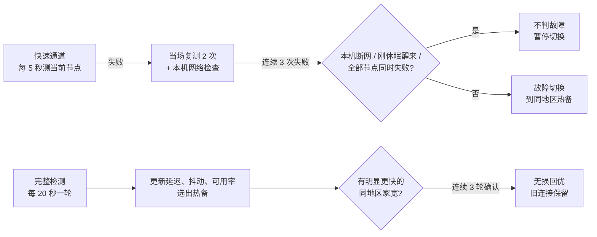

# 稳航 SteadyRoute

稳航是一个跑在 macOS 上的 Clash Verge / Mihomo 家宽线路控制器。它盯着两条代理线路，一直测节点，节点坏了几秒内换到同地区的热备，节点变慢时在不打断现有连接的前提下换到更快的同地区家宽，并在本机提供一个只读看板：

- **AI 台湾家宽线路**：给 ChatGPT、Claude 等 AI 服务用。
- **香港家宽自动备援**：香港出口。

- 只用 Python 3.9 标准库，没有第三方依赖。单进程，由 LaunchAgent 开机自启、异常自动拉起。
- 不改订阅，不碰其他策略组，不上传任何数据。看板只监听 `127.0.0.1:17654`。
- 当前版本：**v0.5.0**（2026-09-29）。

---

## 目录

- [它解决什么问题](#它解决什么问题)
- [铁律：只在同地区家宽之间切换](#铁律只在同地区家宽之间切换)
- [工作原理](#工作原理)
- [看板与页面](#看板与页面)
- [分享给朋友（分享版）](#分享给朋友分享版)
- [安装、发布与回滚](#安装发布与回滚)
- [日志与数据](#日志与数据)
- [资源占用](#资源占用)
- [隐私与安全](#隐私与安全)
- [仓库结构](#仓库结构)
- [开发与测试](#开发与测试)
- [版本历史](#版本历史)
- [路线图](#路线图)
- [文档索引](#文档索引)

---

## 它解决什么问题

AI 服务对出口 IP 很敏感。出口在不同地区之间来回跳，或者从家宽变成机房 IP，都可能触发额外验证。Clash 自带的 `url-test` / `fallback` 只看一次测速的快慢，会出现以下问题：

| Clash 自带策略的问题 | 稳航的做法 |
|---|---|
| 只按单次测速选，抖一下就换，出口频繁变化 | 按平均延迟、抖动、24 小时可用率综合判断；回优有门槛、要连续确认、有冷却时间 |
| 节点断了要等下一次测速（分钟级）才发现 | 当前节点每 5 秒探测，连续 3 次失败即确认，断线到切换约 6 秒 |
| 换节点会打断正在进行的对话、上传 | 回优时旧连接保留到自然结束，只有新请求走新节点 |
| 候选列表写死，订阅换了节点名就失效 | 按名称规则自动发现订阅里的同地区家宽（目前为观察模式） |
| 本机断网、合盖休眠、网站自己挂了，都会被当成节点故障 | 这些情况都能识别，不冤枉节点 |
| 不知道它为什么换、什么时候换 | 看板直接显示原因和下一步；每次决策写入结构化日志 |

---

## 铁律：只在同地区家宽之间切换

> **台湾线路只会换到台湾家宽，香港线路只会换到香港家宽。**

这条规则没有例外。同地区的家宽全部不可用时，稳航保持当前选择、继续检测，并在看板上用红色提示，不会为了"能连上"而换到其他地区或机房节点。

规则在三层都有检查：

1. **加载策略时**：静态候选如果不匹配本地区家宽规则，或者同时匹配多个地区，直接拒绝启动。
2. **选路前**：候选列表按地区和家宽规则再过滤一次。
3. **向 Mihomo 下发切换（`PUT`）前**：最后一次校验，越界的选择直接拒绝并记录。

候选节点按名称识别，规则在 [`config/route-policies.json`](config/route-policies.json) 里：

- 台湾："台湾 / 台灣 / 🇹🇼"加上"家宽 / HINET / Seednet"。
- 香港："香港 / 🇭🇰"加上"家宽 / HKT / HKBN"。
- 排除"到期、剩余流量、官网"这类提示条目。

`DIRECT` 只用于只读的本机网络检测，任何路径都不会把线路切到 `DIRECT`。

---

## 工作原理



### 检测节奏

| 检测 | 频率 | 内容 |
|---|---|---|
| 快速通道 | 每 5 秒 | 只测当前节点，纯 HTTP 204，约 1 KB，2 秒超时 |
| 完整检测 | 每 20 秒一轮（固定速率） | 所有候选的 HTTPS 连通和延迟；热备单独测一次；轮流抽查备用节点 |
| 业务检测 | 每 60 秒 | 通过当前节点和热备打开 AI 网站检测页（台湾：chatgpt.com、claude.ai；香港：grok.com） |
| 本机网络 | 怀疑故障时 | 绕开代理直接测，区分"节点坏了"和"本机没网" |

### 故障切换

1. **发现**：当前节点一次探测失败。
2. **复测**：同一轮内立刻错峰再测 2 次，同时检查本机网络。
3. **确认**：连续 3 次失败才算故障。
4. **切换**：换到同地区热备。热备 120 秒内没有业务检测成功时，先确认它能打开 AI 网站再换。
5. **断开**：只断开还挂在坏节点上的连接，应用会自动重连。

以下情况**不会**判故障：

- 本机断网。
- Mac 刚从休眠醒来。醒来后的第一轮检测只记录成功的结果，不做切换决策。
- 这一轮所有节点同时失败，这时判断为本地或 Clash 的问题。
- 当前节点和热备都打不开同一个 AI 网站。这算网站故障，5 分钟内预检跳过该网址。

**故障风暴保护**：10 分钟内故障切换达到 3 次后，每次切换前都必须完整验证目标节点。

### 无损回优

节点没坏但有更好的同地区家宽时，同时满足以下条件才换：

| 条件 | 默认值 |
|---|---|
| 至少快 | 180 ms **且** 30% |
| 连续确认 | 3 轮 |
| 两次回优间隔 | 30 分钟 |
| 候选要求 | 近 24 小时可用率 ≥ 90%，样本 ≥ 10 |

换节点后，新请求走新节点，旧连接留在原节点直到自然结束。代理组设置了 `interrupt-exist-connections: false`，稳航也不主动关闭旧连接。

**手动偏好**：你在 Clash 里手动选了另一个同地区家宽后，稳航会尊重这个选择 1 小时，期间不回优。但你选的节点坏了仍会故障切换。

### 坏节点隔离

- 10 分钟内失败 3 次 → 隔离 30 分钟，期间不会被选中。
- 隔离期满进入"半开放验证"，连续成功 3 次才恢复。
- 被同一轮其他探测否定的偶发失败（比如复测成功）只计入可用率，不计入隔离。

### 节点状态

| 状态 | 含义 |
|---|---|
| 节点正在预热 | 新节点在积累样本：至少 10 次探测、连续成功 3 次、至少打开过一次 AI 网站 |
| 节点健康 | 可作为当前节点或热备 |
| 节点质量下降 | 能用但最近有失败，不会被主动换上 |
| 节点已隔离 | 暂停使用 |
| 节点正在半开放验证 | 隔离期满，正在确认恢复 |
| 节点已退役 | 已从订阅中消失，记录保留 24 小时 |

所有阈值由后端下发到看板和使用说明页，改了配置页面会自动跟着变。

---

## 看板与页面

所有页面都在本机 `http://127.0.0.1:17654`，只读，不加载任何外部资源，断网时也能打开。

| 地址 | 内容 |
|---|---|
| `/` | **看板**，见下方说明 |
| `/nodes` | **全部节点（只读）**：订阅里的每个节点按地区分组，显示 Clash 自己最近一次测速；标出"当前在用 / 热备 / 候选 / 仅查看"。可按地区、家宽 / 非家宽筛选和搜索 |
| `/guide` | **使用说明**：14 节，从工作原理到每个数字的含义；文中数值从运行中的服务读取 |
| `/changelog` | **更新日志**：每个版本面向使用者的变化，高亮正在运行的版本 |
| `/api/status` | 看板用的状态快照（兼容格式） |
| `/api/v1/status` | 版本化状态契约，见 [STATE_API.md](docs/STATE_API.md) |
| `/api/nodes` | 订阅节点目录（全部节点页用） |
| `/acceptance`、`/candidate-acceptance` | 固定样例验收页、动态候选影子验收页 |

看板包括：

- **顶部状态面板**：动态稳航图标（正常为蓝色，需留意为橙色，故障为红色）、两条线路的实时延迟、24 小时切换次数（故障 / 回优）、内存当前值与峰值、累计检测轮数。
- **两张线路卡片**：当前节点、热备、平均延迟、近 24 小时可用率、抖动、综合评分、活跃连接。
- **延迟曲线**：可看 5 / 15 / 30 分钟。
  - 实线是当前节点，虚线是热备。
  - 红色实线标故障切换，绿色虚线标无损回优。
  - 鼠标悬停或点按可看具体数值。
- **活跃连接面板**：按节点、按网站列出连接。回优交接期间，旧节点上的连接单独标出。只显示域名。
- **节点表**：按地区分组，含状态、连续成功 / 失败次数。
- **指标说明**：每个指标旁的"?"支持悬停、点按和键盘聚焦，并可跳到使用说明对应章节。

所有接口只读取每轮检测结束时生成的缓存，访问页面不会触发任何探测。

---

## 分享给朋友（分享版）

v0.5.0 起，稳航可以装在朋友的 Mac 上（Clash Verge，TUN 模式也可以），不需要改他的 Clash 配置：

- 接管朋友 Clash 里**直接选中了某个节点**的分组，按这个节点的国家锁定（美国就锁美国），之后**只在这个国家的家宽节点之间切换**，不跨国家。
- 朋友在 Clash 里手动换到别的国家，稳航改锁到新国家。
- 当前是同国家的普通节点时，家宽预热好（约 4 分钟）后无损换上；之后手动选普通节点保留 60 分钟，断了立刻换。
- 没有家宽的国家只提示不切换；分组选的是另一个分组（比如"自动选择"）时暂停。
- 装好后先给家宽候选测速约 4 分钟，有了热备之后故障切换才生效。

### 打包与安装

```bash
python3 scripts/share/build_share.py        # 生成 dist/SteadyRoute-share-v<版本>.zip
```

打包时只放程序、分享版配置（`config/route-policies.auto-lock.json`）和安装器，不带作者自己的配置、状态和日志，并自动检查个人信息（本机路径、用户名、订阅链接、密钥、邮箱），发现就拒绝打包。

朋友解压后右键 `install.command` → 打开。安装器会：检查 macOS、Python 3.9+ 和 Clash Verge；拒绝与另一份稳航同时运行；把程序装到 `~/Library/Application Support/SteadyRoute`，日志在 `~/Library/Logs/SteadyRoute`，开机自启 `com.steadyroute.share`；启动后确认看板回报的版本正确，失败自动恢复到上一版（保留最近 3 份备份）。升级再运行一次即可，状态和配置保留。`uninstall.command` 卸载，Clash 设置不受影响。

## 安装、发布与回滚

### 路径

| 用途 | 路径 |
|---|---|
| 源码仓库（唯一开发源） | `/Users/nurture/Projects/steadyroute` |
| 生产目录 | `~/Library/Application Support/Clash-Verge-Stability-Router` |
| 生产备份 | `~/Library/Application Support/Clash-Verge-Stability-Router Backups` |
| 日志 | `~/Library/Logs/Clash-Verge-Stability-Router` |
| LaunchAgent | `~/Library/LaunchAgents/com.nurture.clash-stability-router.plist` |

禁止直接在生产目录修改。紧急修复后必须立即同步回仓库，并补上测试、变更日志和版本记录。

### 发布一个新版本

合并到 `main` 后，在源码仓库执行：

```bash
cd /Users/nurture/Projects/steadyroute
git checkout main && git pull
git tag v$(cat VERSION) && git push origin v$(cat VERSION)

./scripts/check.sh               # 语法、全部测试、配置校验、密钥扫描
./scripts/build-release.sh       # 生成 dist/steadyroute-<版本>.zip 与校验和
./scripts/deploy-local.sh        # 预演：只校验，不写入
./scripts/deploy-local.sh --apply
./scripts/status.sh              # 查看运行状态、最近决策和错误

./scripts/publish-release.sh     # 部署成功后：在 GitHub 发布 Release（说明取自 docs/releases/）
```

`--apply` 会依次执行：

1. 停止旧服务，确认进程和端口都已退出。
2. 完整备份并校验。
3. 原子替换生产目录和 plist。
4. 启动新版本。
5. 自检：LaunchAgent 在运行、状态接口正常、两个代理组存在、当前节点合法、完成了一轮新检测。

任一检查失败都会自动恢复到部署前的版本。生产部署要求工作树干净、当前 commit 带 `v<版本>` 标签。第一次生产写入还需要在终端输入确认短语。

### 回滚

```bash
./scripts/rollback-local.sh          # 预演
./scripts/rollback-local.sh --apply  # 恢复到最近一次备份
```

详见 [本地部署与回滚](docs/DEPLOYMENT.md) 和 [发布流程](docs/RELEASE.md)。

### Clash Verge 代理组

动态发现需要在 Clash Verge 当前订阅里加入两个隐藏的发现组。这是一个独立的控制面，管理命令默认也是 dry-run。执行后需要人工重载 Clash Verge，再只读验证：

```bash
python3 scripts/manage-clash-groups.py --help
python3 scripts/verify-clash-discovery.py --help
```

---

## 日志与数据

日志由应用自己管理：按天和按大小轮换，gzip 压缩，按天数和总量两道上限清理，合计不超过约 38 MB。

| 文件 | 内容 | 保留 | 总量上限 |
|---|---|---|---|
| `router.log` | 日常运行，平稳时限频 | 14 天 | 20 MiB |
| `events.jsonl` | 决策：故障切换、回优、休眠恢复、同地区拦截、线路和服务状态变化，一行一条 JSON | 90 天 | 10 MiB |
| `node-events.jsonl` | 节点状态变化：下降、恢复、隔离、新节点 | 30 天 | 5 MiB |
| `router-error.log` | 警告和错误，10 分钟内相同错误只记一次 | 30 天 | 3 MiB |
| `bootstrap.log` | LaunchAgent 标准输出 / 错误 | — | — |

持久状态在生产目录的 `state.json`（schema 2，只追加字段，旧版本可读）。延迟曲线和连接信息只在内存里，重启即清空。

---

## 资源占用

- **内存**：常驻约 25 MB（模拟环境实测峰值 24.9 MB）。看板显示当前值和峰值，`status.sh` 给出每小时趋势。
- **CPU**：大部分时间空闲，每 20 秒一轮检测，并行探测。
- **网络**：
  - 快速通道每 5 秒约 1 KB。
  - 完整检测每轮对每个候选发一个小的 HTTPS 请求。
  - 业务检测每分钟打开一次很小的检测页。
  - 和正常上网相比可以忽略。

---

## 隐私与安全

- 只监听 `127.0.0.1`，其他设备访问不到；并且只接受 Host 为 `127.0.0.1:17654` 或 `localhost:17654` 的请求，其他一律返回 421。这能防住 DNS rebinding：恶意网页把自己的域名解析到 127.0.0.1，也读不到看板数据。
- 接口和日志使用字段白名单，不输出订阅地址、认证信息、密码和服务器地址。
- 活跃连接只显示域名，不显示 IP、端口和完整网址，也不写入日志或状态文件。
- 所有页面和接口都经过同一个出口，统一带上 CSP（禁止被嵌入其他网页）、`nosniff`、`no-referrer`、`no-store`；页面不加载任何外部资源。
- 检查脚本会扫描疑似密钥。扫描只用 Python 标准库，缺少任何外部工具都不会让它被跳过，发现问题时也不打印密钥本身。

详见 [SECURITY.md](docs/SECURITY.md)。

---

## 仓库结构

```text
src/steadyroute/
  weighted_router.py        主程序：检测、决策、切换、HTTP 服务
  health_model.py           延迟 / 抖动 / 可用率模型与隔离判定
  route_policy.py           策略加载与同地区家宽规则
  candidate_registry.py     订阅候选发现与生命周期
  node_catalog.py           只读订阅节点目录（/api/nodes）
  regions.py                国家与家宽识别
  auto_lock.py              分享版：按当前节点的国家锁定用户自己的分组
  state_contract.py         持久状态与 API 契约、迁移
  logging_setup.py          有界日志轮换
  runtime_metrics.py        内存指标（phys_footprint）
  dashboard.html            看板
  nodes.html  guide.html  changelog.html  pages.css   子页面与共享样式
  acceptance_dashboard.html  candidate_dashboard.html  验收页
config/                     路由策略、Clash Verge 增强配置
deploy/macos/               LaunchAgent 模板
scripts/                    检查、构建、部署、回滚、状态、代理组管理
scripts/share/              分享版打包与安装器
sim/                        假 Mihomo 控制器与上线前模拟验收（不进发布包）
tests/                      单元、集成与回归测试
docs/                       架构、运维、发布、安全、风险、ADR
```

---

## 开发与测试

```bash
./scripts/check.sh
```

依次执行 Python 语法检查、全部单元与集成测试、Clash 配置校验、LaunchAgent plist 校验和密钥扫描。CI 在 GitHub Actions 的 macOS + Python 3.9 上运行同一个脚本。

上线前还会用 [sim/](sim/README.md) 做模拟验收：假 Mihomo 控制器按剧本制造节点断线、节点变慢、本机断网、休眠唤醒、网站故障等场景，同时运行新旧两个版本，对比切换时机、断开的连接和资源占用。

```bash
git worktree add ../steadyroute-prev v0.4.4
python3 sim/run_scenarios.py --old ../steadyroute-prev --new . --out /tmp/sim.json
```

开发流程见 [日常开发完整流程](docs/DAILY_WORKFLOW.md)。

### 版本策略

语义化版本：PATCH 为兼容性修复，MINOR 为兼容的新能力、状态字段或看板功能，MAJOR 为状态格式、配置结构或部署方式的不兼容变化。`1.0.0` 之前契约仍可能调整，但每次都必须附带迁移与回滚说明。

---

## 版本历史

| 版本 | 日期 | 主要变化 |
|---|---|---|
| **0.5.0** | 2026-09-29 | 分享版：装在朋友的 Mac 上，按当前节点的国家锁定、只换该国家家宽；一键安装包；休眠时长合并短暂唤醒 |
| 0.4.6 | 2026-09-27 | 安全加固：只接受本机 Host（防 DNS rebinding）、所有响应带安全头、密钥扫描不再被跳过；24 小时切换统计不再漏算 |
| 0.4.5 | 2026-09-26 | 看板重新设计；5 / 15 / 30 分钟曲线；活跃连接面板；全部节点、使用说明、更新日志页面；`/api/nodes` |
| 0.4.4 | 2026-09-26 | 有界日志（合计 ≤ 38 MB）；偶发丢包不再隔离最优节点；内存当前 / 峰值 |
| 0.4.3 | 2026-09-26 | 5 秒快速通道（断线到切换约 6 秒）；热备；同地区铁律写进代码；断网 / 休眠 / 网站故障识别 |
| 0.4.2 | 2026-09-21 | 手动偏好改为 1 小时；发现组从代理页隐藏 |
| 0.4.1 | 2026-09-21 | 兼容 Clash Verge 2.5.4；重载后恢复原选择 |
| 0.4.0 | 2026-09-20 | 订阅家宽候选自动发现（影子模式） |
| 0.3.0 | 2026-09-20 | 状态 schema v2、决策状态机、`/api/v1/status` |
| 0.2.0 | 2026-09-19 | 原子部署、完整备份、自动恢复、一键回滚 |
| 0.1.0 | 2026-09-19 | 导入稳航选路器与本地看板，建立工程基线 |

完整记录见 [CHANGELOG.md](CHANGELOG.md)。

---

## 路线图

| 版本 | 内容 |
|---|---|
| v0.5.0 | 分享版：装在朋友的 Mac 上，按国家锁定、只换该国家家宽（[#32](https://github.com/z13141557217-web/steadyroute/issues/32)） |
| v0.5.1 | 可选的"AI 家宽专线"模板（作者这套配置） |
| v0.5.x | 选路策略 v2（[#23](https://github.com/z13141557217-web/steadyroute/issues/23)） |
| v0.6.0 | 动态候选正式接管：订阅新增的家宽经预热后直接参与选路（[#24](https://github.com/z13141557217-web/steadyroute/issues/24)） |
| 之后 | 被动检测：利用真实连接的成败辅助判断（[#25](https://github.com/z13141557217-web/steadyroute/issues/25)）；全节点监控与配置页面（[#26](https://github.com/z13141557217-web/steadyroute/issues/26)） |

详见 [ROADMAP.md](docs/ROADMAP.md)。

---

## 文档索引

| 文档 | 内容 |
|---|---|
| [ARCHITECTURE.md](docs/ARCHITECTURE.md) | 架构与模块边界 |
| [STATE_API.md](docs/STATE_API.md) | 持久状态与 API 契约 |
| [OPERATIONS.md](docs/OPERATIONS.md) | 运维、告警与排障 |
| [DEPLOYMENT.md](docs/DEPLOYMENT.md) | 部署与回滚细节 |
| [RELEASE.md](docs/RELEASE.md) | 发布流程与门禁 |
| [TESTING.md](docs/TESTING.md) | 测试策略 |
| [SECURITY.md](docs/SECURITY.md) | 安全与隐私 |
| [RISK_REGISTER.md](docs/RISK_REGISTER.md) | 风险登记 |
| [DAILY_WORKFLOW.md](docs/DAILY_WORKFLOW.md) | 日常开发流程 |
| [GITHUB_SETUP.md](docs/GITHUB_SETUP.md) | GitHub 仓库初始化 |
| [docs/adr/](docs/adr/) | 架构决策记录 |
